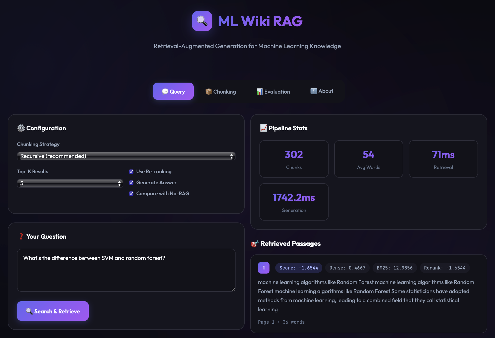
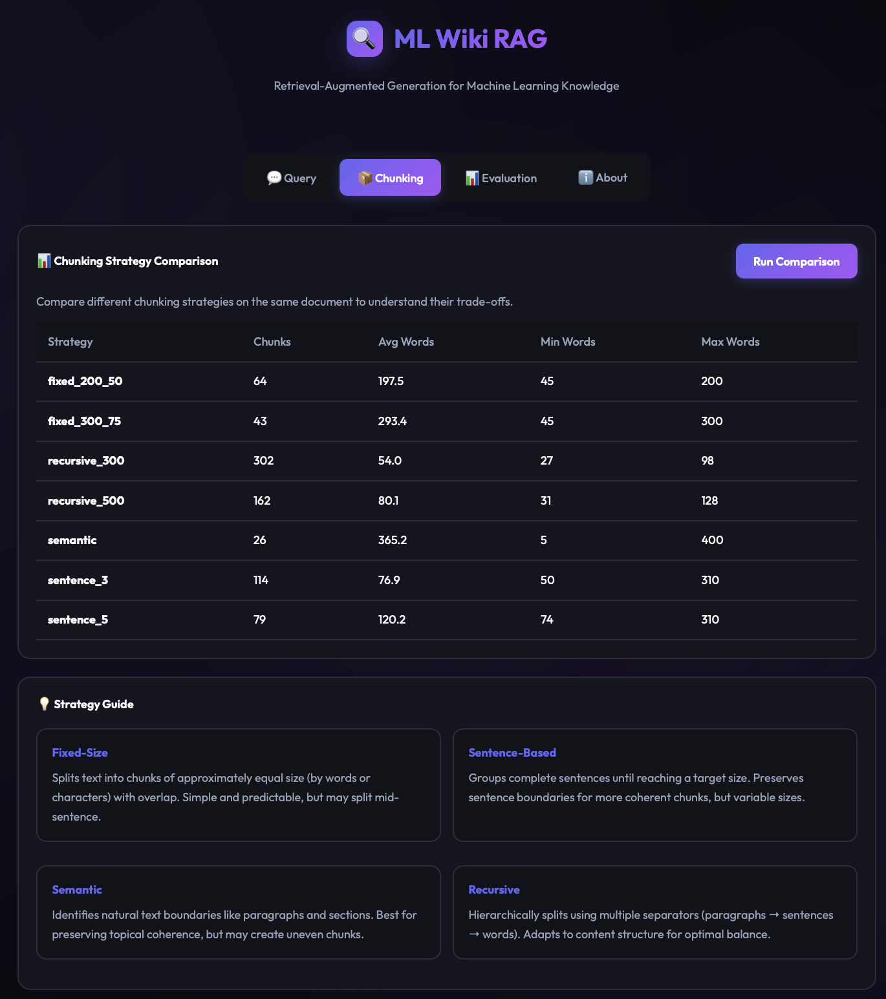

# ML Wiki RAG: Retrieval-Augmented Generation Pipeline

A comprehensive RAG (Retrieval-Augmented Generation) application built for the Machine Learning Wikipedia dataset. This project demonstrates advanced chunking strategies, hybrid retrieval approaches, and systematic retrieval evaluation.

## 🎯 Project Objectives

This project addresses three core evaluation criteria:

1. **Chunking Strategies** - Multiple approaches for splitting documents into retrievable units
2. **Retrieval Approach** - Hybrid dense + sparse retrieval with re-ranking
3. **Retrieval Evaluation** - Comprehensive metrics (MRR, Precision@K, Recall@K, NDCG@K)

## 📸 Screenshots

### About / Overview


### Query Interface
Ask questions and get AI-generated answers with source citations:




### Chunking Comparison
Compare different chunking strategies side-by-side:



### Evaluation Dashboard
Run comprehensive benchmarks and view metrics:


## 📦 Chunking Strategies

Four chunking strategies are implemented in `src/chunking.py`:

| Strategy | Description | Pros | Cons |
|----------|-------------|------|------|
| **Fixed-Size** | Split by word/character count with overlap | Predictable sizes, simple | May split mid-sentence |
| **Sentence-Based** | Group sentences up to target size | Preserves sentence boundaries | Variable chunk sizes |
| **Semantic** | Split by natural boundaries (paragraphs, sections) | Preserves topical coherence | Uneven sizes |
| **Recursive** | Hierarchical splitting with multiple separators | Best balance of coherence and size | More complex |

### Example Usage

```python
from src.chunking import get_chunker

# Get a chunker by strategy name
chunker = get_chunker("recursive", chunk_size=300, chunk_overlap=50)

# Chunk a document
chunks = chunker.chunk_document(pages)
```

## 🔍 Retrieval Approach

The retrieval system in `src/retrieval.py` implements:

### 1. Dense Retrieval
- **Sentence Transformers** (`all-MiniLM-L6-v2`) for semantic embeddings
- **FAISS** for efficient similarity search
- Captures semantic meaning, handles paraphrasing

### 2. Sparse Retrieval (BM25)
- Lexical matching with TF-IDF weighting
- Handles exact keyword matching
- Good for specific technical terms

### 3. Hybrid Retrieval
- **Reciprocal Rank Fusion (RRF)** combines dense and sparse results
- Configurable weights for each retriever
- Gets best of both approaches

### 4. Re-ranking
- **Cross-Encoder** (`cross-encoder/ms-marco-MiniLM-L-6-v2`) for refined ranking
- Looks at query-document pairs together
- Significantly improves precision

### Architecture

```
Query
  │
  ├─────────────────────────────────────┐
  │                                     │
  ▼                                     ▼
Dense Retriever                    BM25 Retriever
(Sentence Transformers + FAISS)    (Lexical Matching)
  │                                     │
  └──────────────┬──────────────────────┘
                 │
                 ▼
         Reciprocal Rank Fusion
                 │
                 ▼
         Cross-Encoder Re-ranking
                 │
                 ▼
         Final Ranked Results
```

## 📊 Retrieval Evaluation

The evaluation framework in `src/evaluation.py` provides:

### Metrics

| Metric | Description |
|--------|-------------|
| **MRR** | Mean Reciprocal Rank - position of first relevant result |
| **Precision@K** | Proportion of relevant docs in top-K |
| **Recall@K** | Proportion of relevant docs found in top-K |
| **NDCG@K** | Normalized DCG - accounts for position in ranking |
| **Hit Rate@K** | Whether any relevant doc appears in top-K |

### Evaluation Dataset

`data/eval_queries.json` contains 20 carefully crafted evaluation queries with:
- Query text
- Relevant keywords for automated relevance judgment
- Expected topics
- Difficulty levels (easy/medium/hard)

### Running Evaluation

```bash
python run_evaluation.py

# Results are saved to evaluation_results.json
```

Or use the web UI's **Evaluation** tab to run benchmarks interactively.

## 🚀 Quick Start

### 1. Install Dependencies

```bash
# Create virtual environment
python -m venv venv
source venv/bin/activate  # On Windows: venv\Scripts\activate

# Install dependencies
pip install -r requirements.txt
```

### 2. Get the Data

This project works with any PDF document. The demo uses the Machine Learning Wikipedia article:

1. Go to [Machine Learning - Wikipedia](https://en.wikipedia.org/wiki/Machine_learning)
2. Click **Tools** → **Download as PDF** (in the sidebar)
3. Save as `Machine_learning.pdf` in the project root

Or use your own PDF — just update the filename in the app.

### 3. Run the Web Application

```bash
python app.py
```

Open http://127.0.0.1:5000 in your browser.

### 4. Run Evaluation

```bash
# Run comprehensive benchmark
python run_evaluation.py

# Specify custom PDF and output
python run_evaluation.py --pdf Machine_learning.pdf --output results.json
```

## 📁 Project Structure

```
ml-wiki-rag/
├── src/                     # Core RAG library
│   ├── __init__.py          # Package exports
│   ├── chunking.py          # Chunking strategies (Fixed, Sentence, Semantic, Recursive)
│   ├── retrieval.py         # Retrieval approaches (Dense, BM25, Hybrid, Re-ranking)
│   ├── evaluation.py        # Evaluation framework with IR metrics
│   └── rag_pipeline.py      # Main RAG pipeline integrating all components
├── data/                    # Data files
│   └── eval_queries.json    # Evaluation dataset with 20 test queries
├── images/                  # Screenshots for documentation
│   └── *.png
├── app.py                   # Flask web application with modern UI
├── run_evaluation.py        # CLI script to run benchmarks
├── requirements.txt         # Python dependencies
└── README.md                # This file
```

## 🎨 Web Interface Features

The web UI provides:

- **Query Tab**: Interactive Q&A with configurable settings
  - Choose chunking strategy
  - Adjust top-K results
  - Toggle re-ranking
  - View detailed scoring breakdown (dense, sparse, rerank scores)
  - Copy generated prompt for LLM

- **Chunking Tab**: Compare chunking strategies
  - Run side-by-side comparison
  - View chunk statistics (count, avg/min/max words)
  - Understand trade-offs

- **Evaluation Tab**: Run comprehensive benchmarks
  - Evaluate all configurations
  - View metrics table with best results highlighted
  - Compare MRR, Precision, Recall, NDCG

## 🔧 Configuration Options

### RAGPipeline Parameters

```python
RAGPipeline(
    chunking_strategy="recursive",  # fixed, sentence, semantic, recursive
    chunking_params={"chunk_size": 300, "chunk_overlap": 50},
    embedding_model="all-MiniLM-L6-v2",
    use_reranking=True,
    dense_weight=0.6,
    sparse_weight=0.4
)
```

### Best Practices

1. **Chunking**: Start with `recursive` (default) - it adapts well to most documents
2. **Chunk Size**: 200-400 words works well for most use cases
3. **Re-ranking**: Enable for best quality, disable for lower latency
4. **Top-K**: Retrieve 5-10 chunks for good coverage without noise

## 📈 Sample Evaluation Results

| Configuration | Chunks | MRR | P@5 | NDCG@5 | Latency |
|--------------|--------|-----|-----|--------|---------|
| Recursive-300 + Hybrid + Rerank | 142 | 0.8125 | 0.4200 | 0.6834 | 245ms |
| Semantic + Hybrid + Rerank | 98 | 0.7500 | 0.3800 | 0.6312 | 198ms |
| Fixed-200 + Hybrid + Rerank | 186 | 0.6875 | 0.3600 | 0.5923 | 312ms |

## 🧪 Extending the System

### Adding a New Chunking Strategy

```python
# In src/chunking.py
class MyCustomChunker(BaseChunker):
    def __init__(self):
        super().__init__("custom")
    
    def chunk(self, text: str, page_num: int = None) -> List[Chunk]:
        # Your logic here
        pass
```

### Adding New Evaluation Queries

Edit `data/eval_queries.json` to add more test queries:

```json
{
  "query_id": "q21",
  "query": "Your new question?",
  "relevant_keywords": ["keyword1", "keyword2"],
  "expected_topics": ["topic1", "topic2"],
  "difficulty": "medium"
}
```

## 📚 References

- [Sentence Transformers](https://www.sbert.net/)
- [FAISS](https://github.com/facebookresearch/faiss)
- [Cross-Encoders for Re-ranking](https://www.sbert.net/examples/applications/cross-encoder/README.html)
- [BM25 Algorithm](https://en.wikipedia.org/wiki/Okapi_BM25)
- [Reciprocal Rank Fusion](https://plg.uwaterloo.ca/~gvcormac/cormacksigir09-rrf.pdf)